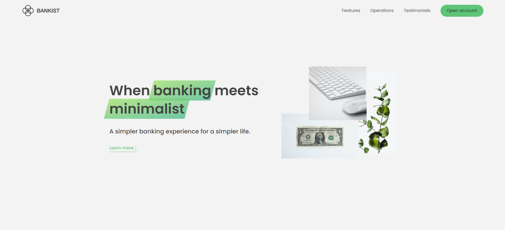

# Bankist - The Minimalist Banking Experience

## Live Demo

Check out the live demo of the project [here](https://bankist-shivam.netlify.app/).

## Description

The Bankist landing page showcases the services and features offered by Bankist, a modern digital bank. Bankist provides a range of convenient and innovative banking services to its customers. This project demonstrates the Bankist website, built using HTML, CSS, and JavaScript, with a focus on modern web design principles to enhance the user experience.

Bankist's Services and Features:

- **100% Digital Bank:** Bankist is a fully digital bank, providing customers with seamless access to their finances. There's no need to visit a physical branch. Customers can manage their money and banking needs from the comfort of their home.

- **Watch Your Money Grow:** Bankist offers investment services with confidence. Their expert team ensures that customers' investments thrive, and their wealth grows steadily over time, allowing customers to say goodbye to financial worries.

- **Free Debit Card Included:** Accessing funds is made easy with Bankist's free debit card. Customers can use it for purchases, withdrawals, and online transactions, with convenience in mind.

### Project Details

The Bankist Landing Page project aims to provide a user-friendly and visually appealing website for a modern bank. It incorporates various interactive and dynamic elements to enhance the user experience. Below, you'll find the key features and visual effects implemented in this project:

- **Navigation:** When hovering over a navigation link, the other items fade out, providing a clear visual indication of the selected link.

- **Smooth Scroll:** When clicking on a navigation link, the page automatically scrolls to the targeted section with a smooth transition, enhancing the overall user experience.

- **Section Fade-In:** As you scroll down the page, each section gradually appears and moves up, creating an engaging and visually appealing effect.

- **Lazy Image Loading:** While scrolling down the page, images are loaded lazily. Initially, a blurred version of the image is displayed, and as you scroll, the blur is replaced with high-quality images. This technique helps improve page loading performance and user experience.

- **Tab Component:** The project includes a custom tab component implemented from scratch. It allows users to switch between different content sections, enhancing the page's interactivity.

- **Slider Component:** The project includes a slider component, complete with next and previous buttons, dot indicators for slide navigation, keyboard arrow key support for changing slides, and an automatic timer that transitions between slides every 5 seconds. This component serves as a dynamic and visually engaging way to display customer testimonials.

- **Modal Window:** Clicking a button triggers the opening of a modal window containing a sign-up form. This interactive element encourages user engagement.

- **Responsive Design:** The Bankist landing page is designed to be responsive and user-friendly across various devices, including desktops, tablets, and phones. The responsive design ensures a consistent experience for all users.

## Screenshots

## Getting Started

1. Clone the repository: `git clone https://github.com/shivsd1004/Bankist.git`
2. Navigate to the project directory: `cd bankist`
3. Open the `index.html` file in a web browser to view the website.

## Usage

Feel free to explore the various features and functionalities implemented in this project. If you have any questions or feedback, please don't hesitate to reach out.
